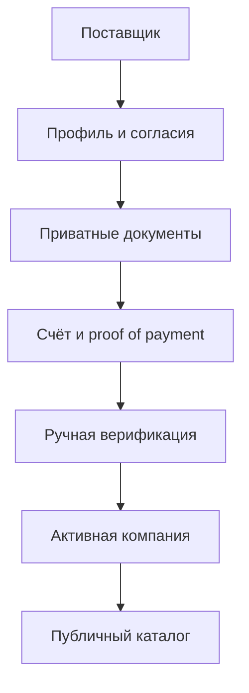

# Architecture: HoReCa KZ MVP

## Решение

Проект построен как **модульный монолит** на Next.js с единой PostgreSQL. Для команды и масштаба MVP это даёт атомарные транзакции, простое развёртывание и быстрые изменения без сетевой сложности микросервисов. Границы модулей уже отражены в коде, поэтому позже их можно выделять по измеренным нагрузкам и организационной необходимости.

Подход опирается на идеи из O’Reilly *Learning Domain-Driven Design*, *Fundamentals of Software Architecture, 2nd Edition*, *Designing Data-Intensive Applications, 2nd Edition* и *Web Application Security, 2nd Edition*: явный язык предметной области, высокая связность внутри модулей, низкое зацепление между ними, атомарные изменения критичного состояния, архитектурные trade-offs и defense in depth.

## Доменные границы

| Контекст | Ответственность | Основные сущности |
|---|---|---|
| Identity & Access | сессии, роли, ownership | User, signed session |
| Supplier Trust | профиль, согласия, документы, верификация | Company, CompanyVerification, CompanyDocument, LegalAcceptance |
| Billing | тариф, счёт, ручной платёж, история | SupplierPlan, Subscription, Invoice, Payment, BillingHistory |
| Catalog | карточки, видимость, ассортимент | Product, ProductCategory, DeliveryCity, ProductImage |
| Demand | B2B-заявки и будущий RFQ | BuyerRequest |
| Operations | модерация и трассируемость | AdminAuditLog, DocumentDownloadLog |

## Инварианты

Инварианты реализованы чистыми policy-функциями в `lib/domain` и транзакционными use cases в `lib/services`.

1. UI не определяет право публикации или активации.
2. Публичный query сам применяет полный trust predicate.
3. Администраторская активация повторно проверяет документы, согласия и оплату.
4. Подтверждение платежа атомарно изменяет Payment, Invoice, Subscription, BillingHistory и AuditLog.
5. Блокировка компании атомарно скрывает её опубликованные товары.

## Потоки данных

## Security boundaries

- Browser не получает storage path и не имеет прямого доступа к файлам.
- Route Handler повторно проверяет роль и ownership для каждой операции.
- File pipeline применяет allowlist, MIME/signature validation, UUID naming и private permissions.
- Admin download создаёт неизменяемую запись доступа.
- Payment confirmation отделена от supplier signal.

## Эволюция на 3–6 месяцев

1. Добавить outbox table для надёжных уведомлений и аналитических событий.
2. Превратить `BuyerRequest` в RFQ aggregate: лоты, приглашения, предложения, дедлайн, award.
3. Добавить append-only price observations и supplier performance facts для data moat.
4. Рассчитывать trust score из проверяемых факторов, не из непрозрачной ручной оценки.
5. Выделять сервисы только после наблюдаемого bottleneck/ownership boundary; первыми кандидатами будут files/malware scanning и notifications.
6. Для платежей использовать provider webhooks, idempotency key, reconciliation и ledger.

## Architecture fitness functions

CI должен оставаться зелёным по пяти проверкам: Prisma validate, strict TypeScript, domain tests, ESLint и production build. Следующие fitness functions: dependency boundary linting, migration test на пустой/предыдущей БД, API contract tests и security scanning.
