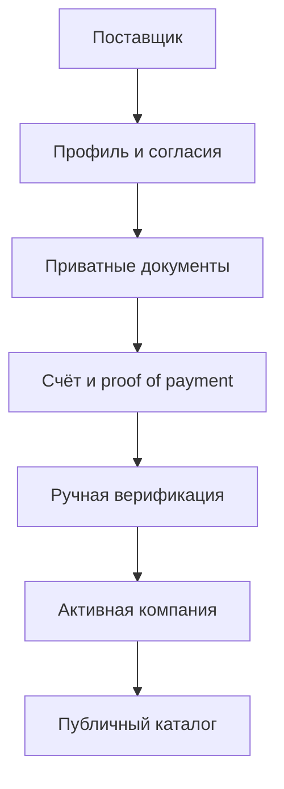

# Architecture: HoReCa KZ MVP

## Решение

Проект построен как **модульный монолит** на Next.js с единой PostgreSQL. Для команды и масштаба MVP это даёт атомарные транзакции, простое развёртывание и быстрые изменения без сетевой сложности микросервисов. Границы модулей уже отражены в коде, поэтому позже их можно выделять по измеренным нагрузкам и организационной необходимости.

Подход опирается на идеи из O’Reilly *Learning Domain-Driven Design*, *Fundamentals of Software Architecture, 2nd Edition*, *Designing Data-Intensive Applications, 2nd Edition* и *Web Application Security, 2nd Edition*: явный язык предметной области, высокая связность внутри модулей, низкое зацепление между ними, атомарные изменения критичного состояния, архитектурные trade-offs и defense in depth.

## Доменные границы

| Контекст | Ответственность | Основные сущности |
|---|---|---|
| Identity & Access | сессии, роли, ownership | User, signed session |
| Supplier Trust | профиль, согласия, документы, верификация | Company, CompanyVerification, CompanyDocument, LegalAcceptance |
| Billing | тариф, счёт, ручной платёж, история | SupplierPlan, Subscription, Invoice, Payment, BillingHistory |
| Catalog | карточки, видимость, ассортимент | Product, ProductCategory, DeliveryCity, ProductImage |
| Demand | B2B-заявки и будущий RFQ | BuyerRequest |
| Operations | модерация и трассируемость | AdminAuditLog, DocumentDownloadLog |

## Инварианты

Инварианты реализованы чистыми policy-функциями в `lib/domain` и транзакционными use cases в `lib/services`.

1. UI не определяет право публикации или активации.
2. Публичный query сам применяет полный trust predicate.
3. Администраторская активация повторно проверяет документы, согласия и оплату.
4. Подтверждение платежа атомарно изменяет Payment, Invoice, Subscription, BillingHistory и AuditLog.
5. Блокировка компании атомарно скрывает её опубликованные товары.
6. Terminal verification attempt не перезаписывается; повторная подача создаёт новую попытку, а aggregate company state меняется compare-and-swap.

## Потоки данных

```mermaid
flowchart TD
  S[Поставщик] --> P[Профиль и согласия]
  P --> D[Приватные документы]
  D --> B[Счёт и proof of payment]
  B --> V[Ручная верификация]
  V --> A[Активная компания]
  A --> C[Публичный каталог]
```

## Security boundaries

- Browser не получает storage path и не имеет прямого доступа к файлам.
- Billing mutations возвращают безопасный payment view с `hasProof`, но без `proofFilePath`.
- Route Handler повторно проверяет роль и ownership для каждой операции.
- File pipeline применяет allowlist, MIME/signature validation, UUID naming и fail-closed HTTPS malware scanner до сохранения; staging/production дополнительно требуют S3-compatible private storage с явным SSE/KMS mode.
- Admin download создаёт неизменяемую запись доступа.
- Payment confirmation отделена от supplier signal.
- Каждая HTML-страница получает уникальный CSP nonce; production CSP не допускает `unsafe-inline`/`unsafe-eval`.
- Mutation API требует явный разрешённый Origin и отклоняет отсутствующий, opaque или cross-site Origin до use case.
- API помечен `no-store`; HSTS и дополнительные browser isolation headers включаются в production build.
- Generic API 500 возвращает correlation ID в body/header и пишет только безопасный structured log без raw error details.
- Rate limit использует локальное состояние только в dev/test или явно access-gated single-replica Beta; production без HTTPS shared backend завершается fail-closed.
- `instrumentation.ts` проверяет deployed runtime до приёма трафика и никогда не возвращает secret values.
- Liveness не зависит от БД; readiness требует допустимую конфигурацию и успешный PostgreSQL probe.

## Deployment boundary

Приложение собирается в Next.js standalone OCI image и запускается non-root. Build применяет deny-by-default проверку верхнего уровня standalone artifact: исходники, тесты, coverage, документация и Android-проект не могут попасть в runtime image из-за ошибочного output tracing. Миграции отделены в one-shot image target, чтобы schema privileges не требовались runtime process. Один immutable image digest продвигается staging → production; rolling rollout требует backward-compatible migrations, readiness gating и возврат на предыдущий digest без destructive DB rollback.

Cloud-specific IaC намеренно не выбран без owner decision. `docs/DEPLOYMENT.md` фиксирует переносимый runtime contract, а `docs/PRIVATE_OBJECT_STORAGE.md` — provider-compatible application boundary. Production provider, workload identity, TLS/WAF, managed PostgreSQL, реально созданные buckets/policies и observe evidence остаются внешними controls.

## Controlled Beta boundary

`APP_ENV=beta` является отдельной launch-средой, а не ослабленной production. До приложения стоит HMAC-подписанная access cookie, выдаваемая только после сравнения secret invitation token; `BETA_ENABLED=false` немедленно блокирует traffic и readiness. По умолчанию self-service registration закрыта. Если используются filesystem/mock scanner/manual payment, UI и API требуют demo-only policy и явное acknowledgement для каждого upload/payment signal и контактов buyer request. Proxy выставляет `noindex`, а `robots.txt` запрещает индексировать всю Beta. Эти ограничения позволяют проверить реальные B2B flows на синтетических данных, но не закрывают commercial storage, payment, identity или Legal controls.

## Эволюция на 3–6 месяцев

1. Добавить outbox table для надёжных уведомлений и аналитических событий.
2. Превратить `BuyerRequest` в RFQ aggregate: лоты, приглашения, предложения, дедлайн, award.
3. Добавить append-only price observations и supplier performance facts для data moat.
4. Рассчитывать trust score из проверяемых факторов, не из непрозрачной ручной оценки.
5. Выделять сервисы только после наблюдаемого bottleneck/ownership boundary; первыми кандидатами будут files/malware scanning и notifications.
6. Для платежей использовать provider webhooks, idempotency key, reconciliation и ledger.

## Architecture fitness functions

CI должен оставаться зелёным по runtime/repository/readiness gates, Prisma validate, strict TypeScript, coverage, ESLint, production build, standalone artifact composition, migration/seed, authenticated HTTP smoke, dependency audit/review и CodeQL. Scheduled Security требует нулевой high/critical production graph и точного совпадения полного high graph с непросроченным advisory allowlist; новый, critical или уже исправленный finding блокирует job без ожидания нового PR. Commercial launch дополнительно требует строгого readiness gate. Следующие fitness functions: dependency boundary linting, migration upgrade test с предыдущей версии, расширенные API contract tests и DAST.
